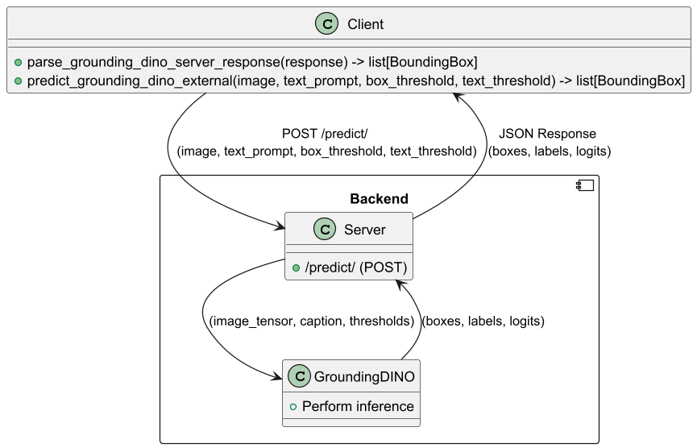

# Automatic Annotation Server

This repository will consist of multiple foundation models that can provide initial annotations for a dataset. Currently, only GroundingDINO is supported.

# Table of Contents
1. [Introduction](#introduction)
2. [Cloning the repository](#cloning-the-repository)
3. [GroundingDINO](#groundingdino)
   - [Install with Docker](#install-with-docker)
   - [Install without Docker](#install-without-docker)
4. [Startup server](#startup-server)
5. [Architecture](#architecture)
   - [Client](#client)
   - [Backend](#backend)
6. [Implementation](#implementation)

## Introduction

This repository provides a server-side implementation for automatic image annotation using advanced object detection models. It is designed to streamline the process of labeling image datasets, making it an ideal tool for use cases like computer vision research, data annotation, and AI model development. Currently, the repository supports GroundingDINO, a powerful object detection model that can generate bounding boxes and labels for objects in images based on natural language prompts.

The system is built with FastAPI, a modern web framework, enabling easy integration with external applications via RESTful APIs. Whether you're using the service in a local development environment or deploying it on a GPU-powered server, the repository provides flexible setup options, including a Docker-based installation for ease of deployment.

By leveraging this automatic annotation server, users can save time and effort in manually annotating large image datasets, while also benefiting from cutting-edge object detection performance powered by GroundingDINO.
## Cloning the Repository

First, clone the repository to your local machine using the following command (This assumes you have Git installed from https://git-scm.com/downloads):

```bash
git clone https://github.com/imaihub/automatic-annotation-server
cd automatic-annotation-server
```

## GroundingDINO

### Install with Docker

First install docker using: 

```bash
sudo apt install docker.io
sudo apt install docker-compose
```

If you wish to run the models on the GPU, install nvidia-container-toolkit following the instructions from (https://docs.nvidia.com/datacenter/cloud-native/container-toolkit/latest/install-guide.html) or execute

```bash
curl -fsSL https://nvidia.github.io/libnvidia-container/gpgkey | sudo gpg --dearmor -o /usr/share/keyrings/nvidia-container-toolkit-keyring.gpg \
  && curl -s -L https://nvidia.github.io/libnvidia-container/stable/deb/nvidia-container-toolkit.list | \
    sed 's#deb https://#deb [signed-by=/usr/share/keyrings/nvidia-container-toolkit-keyring.gpg] https://#g' | \
    sudo tee /etc/apt/sources.list.d/nvidia-container-toolkit.list

sudo apt-get update
sudo apt-get install -y nvidia-container-toolkit
sudo apt-get install -y nvidia-docker2

# Add Docker's official GPG key:
sudo apt-get update
sudo apt-get install ca-certificates curl
sudo install -m 0755 -d /etc/apt/keyrings
sudo curl -fsSL https://download.docker.com/linux/ubuntu/gpg -o /etc/apt/keyrings/docker.asc
sudo chmod a+r /etc/apt/keyrings/docker.asc

# Add the repository to Apt sources:
echo \
  "deb [arch=$(dpkg --print-architecture) signed-by=/etc/apt/keyrings/docker.asc] https://download.docker.com/linux/ubuntu \
  $(. /etc/os-release && echo "${UBUNTU_CODENAME:-$VERSION_CODENAME}") stable" | \
  sudo tee /etc/apt/sources.list.d/docker.list > /dev/null
sudo apt-get update

sudo apt-get install -y docker-compose-plugin

sudo nvidia-ctk runtime configure --runtime=docker
sudo systemctl restart docker
```

To run this server locally in a Docker container, run

```bash
sudo docker compose up
```

After starting the newly build Docker image, the server is ready to receive requests. For the client-side functions, refer to [client](#client)

### Install without Docker

CUDA needs to be installed and CUDA_HOME needs to be set to that directory (often somewhere like usr/local/cuda-12.6)

To install CUDA Toolkit 12.6 on Ubuntu 24.04, run the following:

```bash
wget https://developer.download.nvidia.com/compute/cuda/repos/ubuntu2404/x86_64/cuda-ubuntu2404.pin
sudo mv cuda-ubuntu2404.pin /etc/apt/preferences.d/cuda-repository-pin-600
wget https://developer.download.nvidia.com/compute/cuda/12.6.3/local_installers/cuda-repo-ubuntu2404-12-6-local_12.6.3-560.35.05-1_amd64.deb
sudo dpkg -i cuda-repo-ubuntu2404-12-6-local_12.6.3-560.35.05-1_amd64.deb
sudo cp /var/cuda-repo-ubuntu2404-12-6-local/cuda-*-keyring.gpg /usr/share/keyrings/
sudo apt-get update
sudo apt-get -y install cuda-toolkit-12-6
```

You should set the environment variable manually as follows if you want to build a local GPU environment:
```bash
export AM_I_DOCKER=False
export BUILD_WITH_CUDA=True
export CUDA_HOME=/usr/local/cuda-12.6/ # Update if using another CUDA version
```

Install the package requirements
```bash
pip install -r requirements_pinned.txt
```

Install Grounding DINO:
```bash
pip install --no-build-isolation -e GroundingDINO
```

Download the weights
```bash
wget https://github.com/IDEA-Research/GroundingDINO/releases/download/v0.1.0-alpha/groundingdino_swint_ogc.pth
```

### Startup server


Start the fastapi server:
```bash
uvicorn grounding_dino_server:app --host 0.0.0.0 --port 8901
```

## Architecture

The following diagram illustrates the global architecture of the Automatic Annotation Server. It highlights the interaction between the Client, the Server, and the GroundingDINO model.


### Client

The client represents an application or system that interacts with the server to request object detection and annotation for images. The client has two key operations:
- parse_grounding_dino_server_response(response): This function is responsible for parsing the JSON response returned by the server after the object detection process. It converts the response into a list of bounding boxes (BoundingBox objects), each representing an object detected in the image.
- predict_grounding_dino_external(image, text_prompt, box_threshold, text_threshold): This function is responsible for sending an image, along with a natural language text prompt describing the objects to be detected, and the confidence thresholds (box_threshold, text_threshold) to the server. It interacts with the /predict/ endpoint to initiate object detection using the GroundingDINO model.

### Backend
The Backend is responsible for processing the client's request and performing object detection using the GroundingDINO model. It consists of two core components:
- Server:
  - The FastAPI server exposes the /predict/ endpoint, which accepts POST requests from the client. The request contains the image and relevant parameters (text prompt and thresholds).
  - The server preprocesses the image, forwards it to the GroundingDINO model for inference, and returns the model's results (bounding boxes, object labels, and confidence scores) back to the client as a JSON response.
- GroundingDINO:
  - GroundingDINO is a state-of-the-art object detection model. Upon receiving the preprocessed image and text prompt from the server, it performs inference to detect objects in the image.
  - The model returns bounding boxes around detected objects, labels that describe each object, and confidence scores (logits) that indicate the certainty of the model’s predictions.

## Implementation

Once the server is up and running, you can start sending requests by calling the predict_grounding_dino_external() function from your client-side code. 
Make sure to provide the server's IP address (the default is localhost) as part of the function call. 
This function will handle the communication with the server, and GroundingDINO will handle the object detection.

